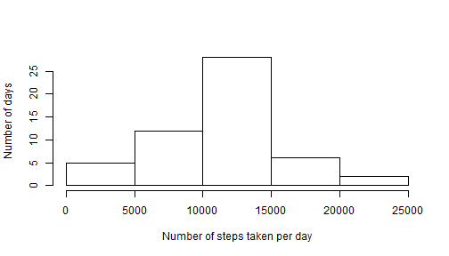
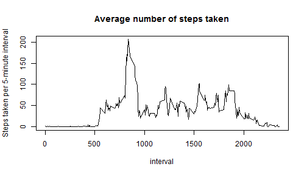
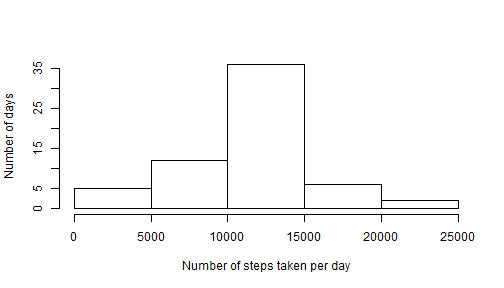
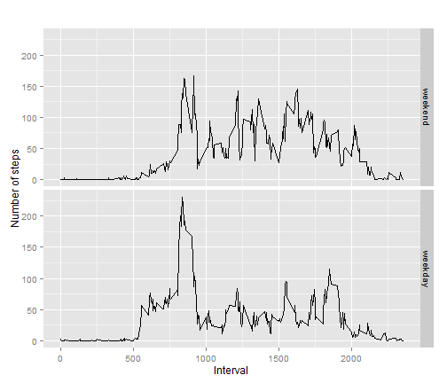

# Reproducible Research
# Peer Assessment 1
submitted by Peter Ip

## Introduction

This assessment makes use of data from a personal activity monitoring device. 
This device collects data at 5 minute intervals throughout the day. The 
dataset consists of two months of data from an anonymous individual collected 
during the months of October and November, 2012 and includes the number of 
steps taken in 5 minute intervals each day.  
  
The data file "activity.csv" is copied into the R working directory before being 
loaded into R. The date variable is converted to "Date" format to facilitate 
subsequent analysis. The packages "dplyr", "lubridate" and "ggplot2" are also 
installed and loaded for use in this assessment.


```r
df <- read.csv("activity.csv")
df$date <- as.Date(df$date, "%Y-%m-%d")
install.packages("dplyr")
```

```
## Installing package into 'C:/Users/Peter Ip/Documents/R/win-library/3.1'
## (as 'lib' is unspecified)
```

```
## Warning in install.packages :
##   downloaded length 2596723 != reported length 2596723
## package 'dplyr' successfully unpacked and MD5 sums checked
## 
## The downloaded binary packages are in
## 	C:\Users\Peter Ip\AppData\Local\Temp\RtmpIr1XN9\downloaded_packages
```

```r
library(dplyr)
```

```
## Warning: package 'dplyr' was built under R version 3.1.3
```

```
## 
## Attaching package: 'dplyr'
## 
## The following object is masked from 'package:stats':
## 
##     filter
## 
## The following objects are masked from 'package:base':
## 
##     intersect, setdiff, setequal, union
```

```r
install.packages("lubridate")
```

```
## Installing package into 'C:/Users/Peter Ip/Documents/R/win-library/3.1'
## (as 'lib' is unspecified)
```

```
## Warning in install.packages :
##   downloaded length 665902 != reported length 665902
## package 'lubridate' successfully unpacked and MD5 sums checked
## 
## The downloaded binary packages are in
## 	C:\Users\Peter Ip\AppData\Local\Temp\RtmpIr1XN9\downloaded_packages
```

```r
library(lubridate)
```

```
## Warning: package 'lubridate' was built under R version 3.1.3
```

```r
install.packages("ggplot2")
```

```
## Installing package into 'C:/Users/Peter Ip/Documents/R/win-library/3.1'
## (as 'lib' is unspecified)
```

```
## package 'ggplot2' successfully unpacked and MD5 sums checked
## 
## The downloaded binary packages are in
## 	C:\Users\Peter Ip\AppData\Local\Temp\RtmpIr1XN9\downloaded_packages
```

```r
library(ggplot2)
```

```
## Warning: package 'ggplot2' was built under R version 3.1.3
```

## Mean and median of total number of steps taken per day

The total number of steps taken per day is summarised in "dailytotal" with 
missing values in the dataset ignored, and a histogram is shown below to allow 
visualisation of its distribution. 


```r
df1 <- group_by(df, date)
dailytotal <- summarise(df1,totalsteps=sum(steps))
hist(dailytotal$totalsteps, xlab="Number of steps taken per day", ylab="Number of days", main="")
```

 

```r
mean1 <- round(mean(dailytotal$totalsteps,na.rm=T),0)
median1 <- round(median(dailytotal$totalsteps,na.rm=T),0)
format(mean1, scientific=F)
```

```
## [1] "10766"
```

```r
format(median1, scientific=F)
```

```
## [1] "10765"
```

The mean of the total number of steps taken per day is *1.0766 &times; 10<sup>4</sup>*, and 
the median is *1.0765 &times; 10<sup>4</sup>*.  

## Average daily activity pattern

A time series plot of the average number of steps taken in each 5-minute 
interval, averaged across all days with missing values in the dataset ignored, 
is shown below.


```r
df2 <- group_by(df, interval)
intervalavg <- summarise(df2,avgsteps=mean(steps,na.rm=T))
plot(intervalavg, type="l", ylab="Steps taken per 5-minute interval", main="Average number of steps taken")
```

 

```r
maxinterval <- intervalavg[which.max(intervalavg$avgsteps),]
maxsteps <- round(maxinterval[2],0)
```

The 5-minute interval, on average across all the days in the dataset, 
containing the maximum number of steps is *835*, and the 
corresponding maxiumum number of steps is *206*.

## Imputing missing values


```r
countna <- 0
for (i in 1:nrow(df)) {
  if (is.na(df[i,1])) {
    countna <- countna + 1
  }
}
```

There are missing values on 8 days during the 2-month period covered by the 
dataset. The total number of missing values is *2304*.

In order to have a complete dataset with no missing values, the missing values 
in the original dataset are filled by using the mean of the same 5-minute 
interval on all other days when data exist. A histogram of the new dataset is 
shown below for comparison with the one shown earlier above from the 
original dataset.  


```r
dfnafilled <- df
for (i in 1:nrow(df)) {
  if (is.na(df[i,1])) {
    defaultval <- subset(intervalavg,interval==df[i,3])
    dfnafilled[i,1] <- defaultval[1,2]
  }
}
dfnafilled1 <- group_by(dfnafilled, date)
dailytotal <- summarise(dfnafilled1,totalsteps=sum(steps))
hist(dailytotal$totalsteps, xlab="Number of steps taken per day", ylab="Number of days", main="")
```

 

```r
mean2 <- round(mean(dailytotal$totalsteps),0)
median2 <- round(median(dailytotal$totalsteps),0)
format(mean2, scientific=F)
```

```
## [1] "10766"
```

```r
format(median2, scientific=F)
```

```
## [1] "10766"
```

The mean of the total number of steps taken per day in this new dataset is 
*1.0766 &times; 10<sup>4</sup>*, and the median is *1.0766 &times; 10<sup>4</sup>*. These values are for 
all practical purpose identical to the estimates from the first part of the 
assessment calculated from the original dataset with missing values ignored. 
Imputing missing data on the estimates of the total daily number of steps by
using the average values of the original dataset has no impact on the mean and 
median.

## Differences in activity patterns between weekdays and weekends

Using the dataset with the filled-in missing values, a new factor variable is 
created with two levels – “weekday” and “weekend” indicating whether a given 
date is a weekday or weekend day.

A panel plot containing a time series plot of the average number of steps taken 
in each 5-minute interval, averaged across all weekday days or weekend days, is 
shown below for comparison.


```r
dfnafilled$daytype <- wday(dfnafilled$date)
for (i in 1:nrow(dfnafilled)) {
  if (dfnafilled[i,4] %in% 2:6) {
    dfnafilled[i,4] <- 0
  }
  else {
    dfnafilled[i,4] <- 1
  }
}
dfnafilled$daytype <- factor(dfnafilled$daytype, levels=c(1,0), labels=c("weekend","weekday"))
x <- aggregate(steps ~ interval + daytype, dfnafilled, FUN = mean)
p <- ggplot(x, aes(interval,steps)) + geom_line(stat="identity") + xlab("Interval") + ylab("Number of steps") + ggtitle("")
p + facet_grid(daytype ~ .)
```

 
